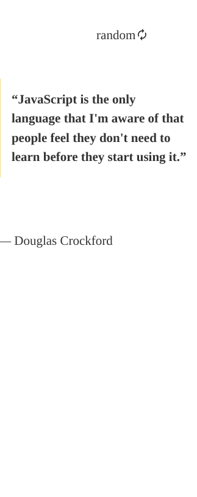

<h1 align="center">Quote Generator</h1>

   Solution for a challenge from  <a href="https://legacy.devchallenges.io/challenges/8Y3J4ucAMQpSnYTwwWW8" target="_blank">Devchallenges.io</a>.

## Table of Contents

- [Overview](#overview)
  - [Screenshots](#screeshots)
  - [Link](#link)
  - [Built With](#built-with)
- [Features](#features)
- [Thoughts](#thoughts)
- [Useful Resources](#useful-resources)

## Overview

### Screeshots

### Link

[Live Link](https://jdegand.github.io/quote-generator)

### Built With

- [React](https://reactjs.org/)
- [Quotable](https://github.com/lukePeavey/quotable)
- [Programming Quotes API](http://programming-quotes-api.herokuapp.com/index.html) - Previous API
- [Material Design Icons](https://materialdesignicons.com/)

## Features

This application/site was created as a submission to a [DevChallenges](https://devchallenges.io/challenges) challenge. The [challenge](https://legacy.devchallenges.io/challenges/8Y3J4ucAMQpSnYTwwWW8) was to build an application to complete the given user stories.

## Thoughts

- Originally, this app used Programming Quotes API.  That API is no longer hosted anywhere so I swapped to the Quotable API.
- Conversion required changing api calls and slight modifications in the components. 
- Go Quotes API is now also dead.
- Quotable seems to be best free quote api that doesn't require an api key.  Alternatives are listed in the useful resources section. 
- Logic could be overhauled.  Make the api request in AuthorQuotes component itself and pass the author name to the route.  To pass author name, you add it as a query parameter.    

## Useful Resources

- [Steps to replicate a design with only HTML and CSS](https://devchallenges-blogs.web.app/how-to-replicate-design/)
- [Quotes.rest API](https://quotes.rest/)
- [Zen Quotes](https://zenquotes.io/)
- [Quotes.net](https://www.quotes.net/quotes_api.php) - requires api key
- [They Said So](https://theysaidso.com/api/) - very small amount of quotes allowed and api key required
- [FreeCodeCamp Forums](https://forum.freecodecamp.org/t/free-api-inspirational-quotes-json-with-code-examples/311373/13) - simple quote api
- [Junior Developer Central](https://www.juniordevelopercentral.com/6-random-quote-apis/) - 6 random quote apis
- [Stack Overflow](https://stackoverflow.com/questions/14110288/a-good-api-for-famous-quotes) - quote apis
- [Medium](https://davidpnowak.medium.com/random-quote-machine-generator-challenge-9d0b732c6af4) - random quote machine challenge
- [Stack Overflow](https://stackoverflow.com/questions/64451451/call-function-in-useeffect-only-after-previous-are-finished) - multiple functions in a useEffect function
- [Stack Overflow](https://stackoverflow.com/questions/66713351/react-js-props-turns-undefined-after-refresh) - props undefined on refresh
- [Stack Oveflow](https://stackoverflow.com/questions/5004978/check-if-page-gets-reloaded-or-refreshed-in-javascript) - check for refresh
- [Stack Overflow](https://stackoverflow.com/questions/70784027/how-to-get-check-if-a-page-gets-reloaded-with-js) - check for refresh
- [Digital Ocean](https://www.digitalocean.com/community/tutorials/7-ways-to-implement-conditional-rendering-in-react-applications#5-using-logical-short-circuit-evaluation) - conditional rendering & react
- [Nordic Apis](https://nordicapis.com/10-free-to-use-cors-proxies/) - cors proxies
- [Blog](https://blog.grida.co/cors-anywhere-for-everyone-free-reliable-cors-proxy-service-73507192714e) - cors proxy service
- [app.cors.bridged](https://app.cors.bridged.cc/settings#proxy) - cors proxy 
