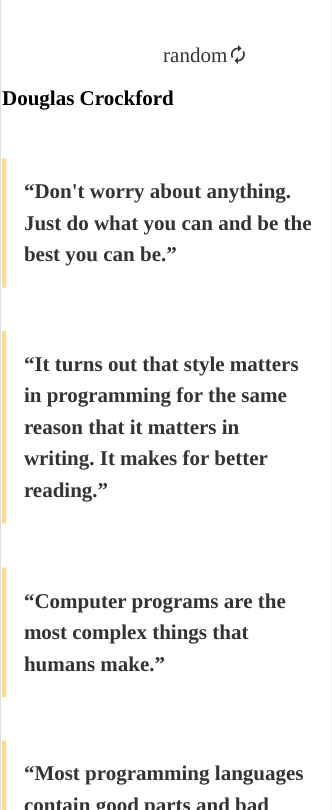

# Quote Generator

Solution for a challenge from [DevChallenges](https://web.archive.org/web/20240526051740/https://legacy.devchallenges.io/challenges/8Y3J4ucAMQpSnYTwwWW8).
   
**Note**: This app no longer works because the API used has been abandoned. I may look into alternatives, or I may archive the repo.

## Table of Contents

- [Overview](#overview)
  - [Screenshots](#screeshots)
  - [Built With](#built-with)
- [Features](#features)
- [Thoughts](#thoughts)
- [Useful Resources](#useful-resources)

## Overview

### Screeshots

### Built With

- [React](https://reactjs.org/)
- [Quotable](https://github.com/lukePeavey/quotable)
- [Programming Quotes API](http://programming-quotes-api.herokuapp.com/index.html) - Previous API
- [Material Design Icons](https://materialdesignicons.com/)

## Features

This application/site was created as a submission to a [DevChallenges](https://devchallenges.io/challenges) challenge. The [challenge](https://web.archive.org/web/20240526051740/https://legacy.devchallenges.io/challenges/8Y3J4ucAMQpSnYTwwWW8) was to build an application to complete the given user stories. **Note**: The previous design document may be incomplete, as you need to find an archived version of the challenge as all `legacy` challenges have had their documentation removed from DevChallenges.

## Thoughts

- Originally, this app used the Programming Quotes API.  That API is no longer hosted anywhere so I swapped to the Quotable API.
- The conversion required changing API calls and slight modifications in the components. 
- Quotable was one of the best free quote APIs that didn't require an API key. Unfortunately, the Quotable API seems to be defunct and the repo maintainer has not responded for many months so this repo no longer works.  
- Logic could be overhauled.  You could make the API request in `AuthorQuotes` component and pass the author name to the route. To pass author name, you add it as a query parameter.    

## Useful Resources

- [Steps to replicate a design with only HTML and CSS](https://devchallenges-blogs.web.app/how-to-replicate-design/)
- [Quotes.rest API](https://quotes.rest/)
- [Zen Quotes](https://zenquotes.io/)
- [Quotes.net](https://www.quotes.net/quotes_api.php) - requires api key
- [They Said So](https://theysaidso.com/api/) - very small amount of quotes allowed and api key required
- [FreeCodeCamp Forums](https://forum.freecodecamp.org/t/free-api-inspirational-quotes-json-with-code-examples/311373/13) - simple quote api
- [Junior Developer Central](https://www.juniordevelopercentral.com/6-random-quote-apis/) - 6 random quote apis
- [Stack Overflow](https://stackoverflow.com/questions/14110288/a-good-api-for-famous-quotes) - quote apis
- [Medium](https://davidpnowak.medium.com/random-quote-machine-generator-challenge-9d0b732c6af4) - random quote machine challenge
- [Stack Overflow](https://stackoverflow.com/questions/64451451/call-function-in-useeffect-only-after-previous-are-finished) - multiple functions in a useEffect function
- [Stack Overflow](https://stackoverflow.com/questions/66713351/react-js-props-turns-undefined-after-refresh) - props undefined on refresh
- [Stack Oveflow](https://stackoverflow.com/questions/5004978/check-if-page-gets-reloaded-or-refreshed-in-javascript) - check for refresh
- [Stack Overflow](https://stackoverflow.com/questions/70784027/how-to-get-check-if-a-page-gets-reloaded-with-js) - check for refresh
- [Digital Ocean](https://www.digitalocean.com/community/tutorials/7-ways-to-implement-conditional-rendering-in-react-applications#5-using-logical-short-circuit-evaluation) - conditional rendering & react
- [Nordic Apis](https://nordicapis.com/10-free-to-use-cors-proxies/) - cors proxies
- [Blog](https://blog.grida.co/cors-anywhere-for-everyone-free-reliable-cors-proxy-service-73507192714e) - cors proxy service
- [app.cors.bridged](https://app.cors.bridged.cc/settings#proxy) - cors proxy 
